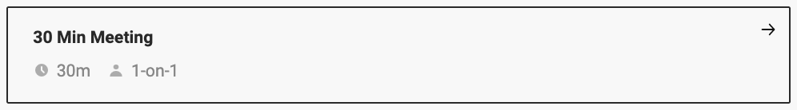

<h1 align="left">I'm Ahmad Aghazadeh. </h1>

As a Senior Android developer with over 10 years of professional experience. I focus on Android applications and their integration with the back end. Therefore, commitment to collaborative problem-solving, critical thinking, obeying Clean Code, Scrum, Clean Architecture, TDD, BDD, writing tests, and creating quality products is essential. I also mentor and guide staff and review their code. I am skilled in Java and Kotlin. Furthermore, I work in an agile team and I constantly strive to learn upcoming technologies to upgrade myself. 

 Android Developer | Mobile Developer

 

 
 
 
 Pick a slot if you'd like to meet me and chat about anything you are passionate about - but make sure to describe the agenda
 
 

 
   

 
 <strong>
   Professional skills
  </strong>

 
  
  
  
  
  

 

 

  

 

  
  

 

